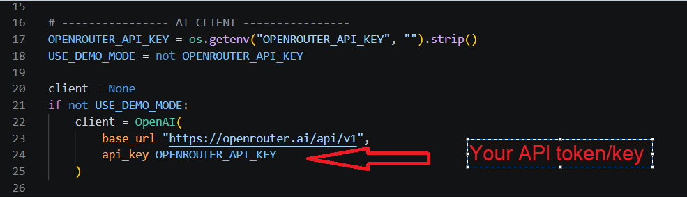
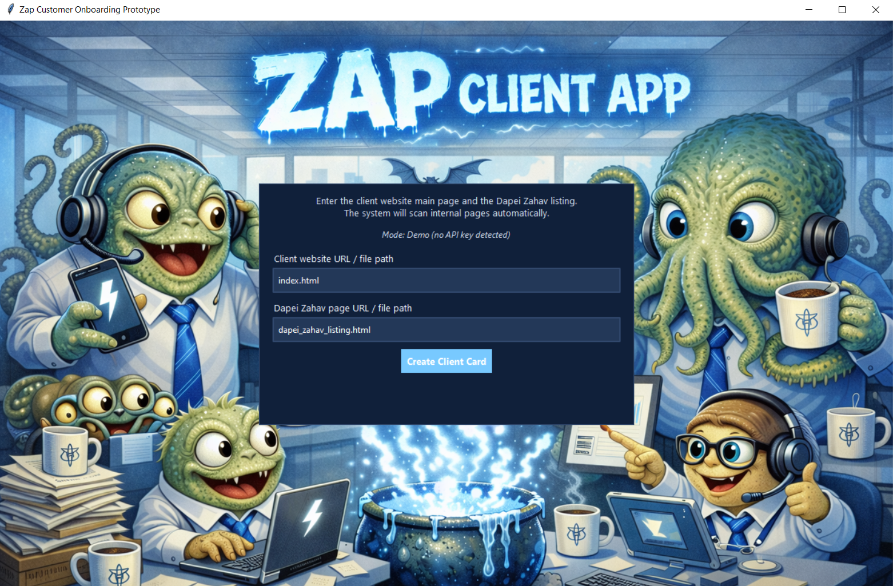
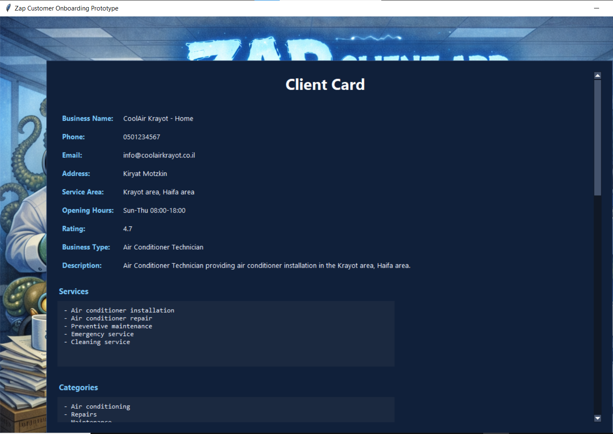
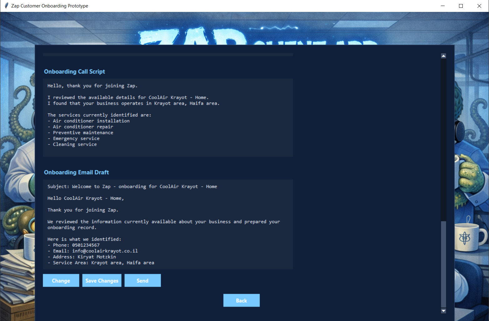

# Zap Customer Onboarding Prototype

## Original Plan and Main Idea

My original plan was to create a desktop `.exe` application that could run on any computer.  
The app would allow the user to enter a client website (up to 5 pages) and a Dapei Zahav page.

Then, the content of those digital assets would be sent through a small 24/7 server to an OpenAI-compatible API using a detailed prompt.  
The idea was that the AI agent would process both sources, extract all the relevant business information, and send the structured result back to the desktop app in order to create a ready client card.

To make this work properly, I needed to use a server because the API key must remain private and should not be exposed inside the desktop application.

Unfortunately, in the short time available for this task, the free servers I tested were not stable enough for a reliable final submission.

Because of that, I decided to upload the application code to GitHub instead.  
The reviewer can run the project locally with their own API key, and if needed I can also provide access details separately.


You can put your API key in line 24!
 
Without API key programm will run on a second mode - DEMO AI mode!
App runs on symulated client sites so look in the end for "Important Note" - I wrote how to run it! 

P.S: I can make the server work but unfortunatelly right now I need to submit this task before 09.04.2026.
## Overview
This project is a prototype for automating onboarding of a new business client for Zap.

The system:
- scans a client website (simulation only)
- scans an external directory listing (simulating a Dapei Zahav mini-site)
- extracts relevant business information
- creates a structured client card
- generates a personalized onboarding call script
- generates an onboarding email draft
- saves the result into a local CRM simulation by SQL!

Style:
I decided to use more funny and friendly style:


And the clients page will look like this:



## Goal
To show that I can work with ai tools and create fast AI agent solutions!

## Main Flow
1. The user enters:
   - the main client website page (Clients site)
   - the external listing page (Dapei Zahav)
2. The system crawls internal HTML pages from the main website with Ai agent with API key OR
with a working DEMO like it is on git!
3. It extracts visible text from the website and external listing
4. It builds a structured onboarding record
5. It generates:
   - client card
   - onboarding call script
   - onboarding email draft
   (All saved in SQL db that plays the role of CRM)
6. It stores the outputs in:
   - local SQLite CRM simulation
   - JSON payload
   - text email draft

## Modes

### 1. Demo Mode
If no API key is provided, the app runs in demo mode.

In demo mode, the system performs local rule-based extraction from the provided HTML/text, including:
- phone
- email
- business name
- service area
- opening hours
- business type
- services/categories

This allows the reviewer to run the prototype without external setup.

### 2. Live AI Mode
If an `OPENROUTER_API_KEY` environment variable is provided, the app uses live AI extraction.
Every possible page related to Ai agents strongly suggested to keep this key a secret so a key will be provided via email if needed!

## Technologies Used
- Python
- Tkinter
- SQLite
- OpenAI-compatible API client
- Pillow

## Files Generated During Run
- `crm_demo.db` – local CRM simulation database
- `crm_payload.json` – structured output payload
- `email_draft.txt` – onboarding email draft

## How to Get the Project
## Important Note

For this submission, the app runs by default on simulated sites that are included in the project folder.

These files simulate:
- a 5-page client website
- a Dapei Zahav page

I included them in the repository so the reviewer can run the project immediately without needing a real live website.

Default files used by the app:
- `index.html`
- `about.html`
- `services.html`
- `contact.html`
- `faq.html`
- `dapei_zahav_listing.html`

### Option 1 – Download ZIP
1. Open the GitHub repository page
2. Click **Code**
3. Click **Download ZIP**
4. Extract the ZIP to a local folder
5. Open that folder in terminal or VS Code

### Option 2 – Clone with Git
```bash
git clone https://github.com/RenatKarimovBMF/zap-onboarding-prototype.git
cd zap-onboarding-prototype

